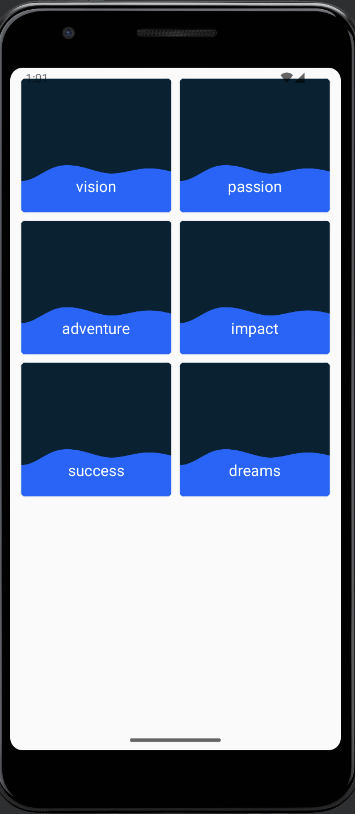
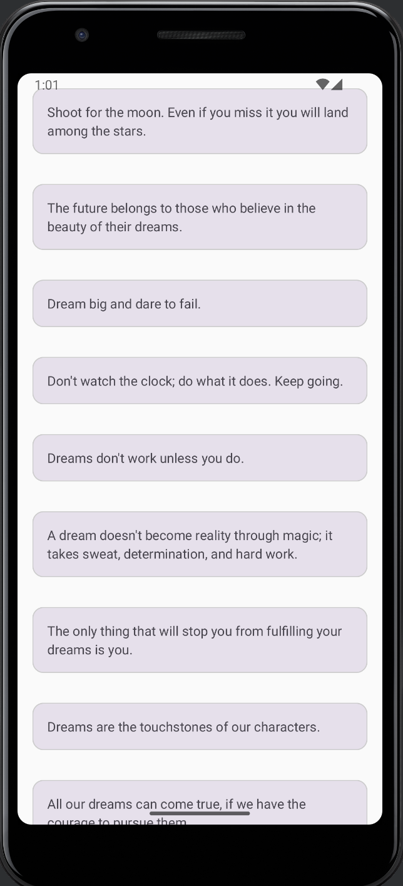

# Created an Tweets App using MVVM, Retrofit, Coroutine, HILT, Navigation for Compose

## Screenshots

Below Screenshots show we are navigating from Category Screen to Details Screen. Also list of Tweets of category selected by the user is shown.

 
